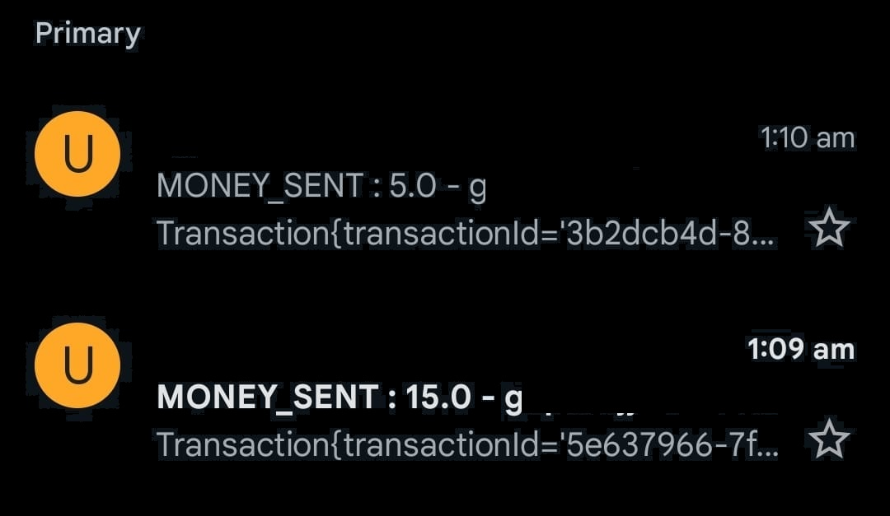
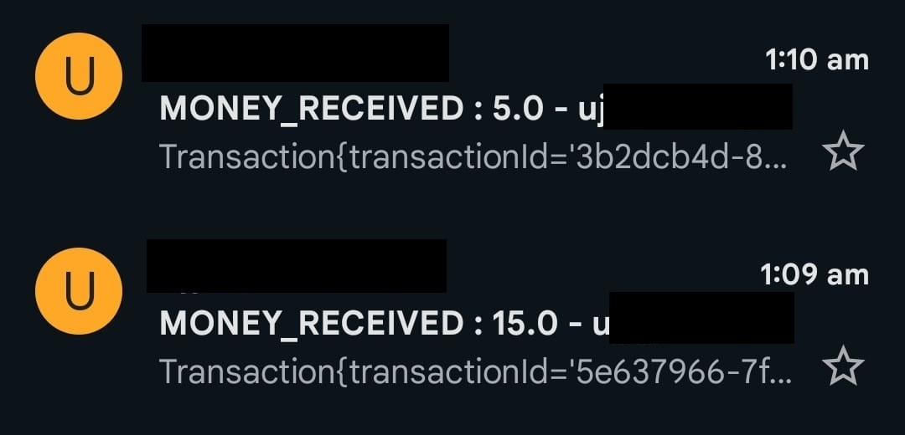

# MyWallet

### FEATURES
<ul>
<li>ADD/WITHDRAW money in wallet</li>
<li>SEND money to contacts</li>
<li>GET cashbacks</li>
<li>EMAIL based OTP and transaction alerts</li>
<li>Transaction History</li>
</ul>

### TECH STACK

|  |  |
|----------|----------|
| Frontend   | React, Redux   |
| Backend   | Java, Spring Boot   |
| Database   | MongoDB   |
| Unit Testing   | Jest, JUnit   |

## Home Screen
.jpeg)
.jpeg)
.jpeg)

## Login
.jpeg)

## User Home Page (After Login)
.jpeg)

## Send Money
.jpeg)
.jpeg)

## Email Alerts
### SENT

### RECEIVED

## Transaction History
.jpeg)
.jpeg)

## Wallet
.jpeg)
.jpeg)

## Cashback
.jpeg)

## Account Settings
.jpeg)

## Show Balance
.jpeg)

## Signup
.jpeg)
